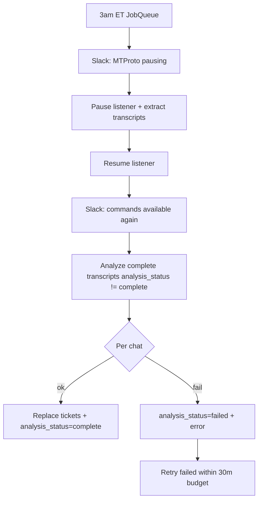

# Group chat ticket analysis (segment + classify)

## Overview

After the nightly T+1 transcript extract resumes MTProto, run Claude segmentation + classification on complete transcripts, persist tickets in Postgres, and expose them via JWT REST. No FRT/ART aggregation or Markdown manager report in this pass.

## Scope

**In**
- Segment each complete daily transcript into tickets
- Classify each ticket (`category`, `events`, `summary`)
- Store tickets; track analysis status on the transcript
- JWT REST list + per-chat detail
- Wire into existing 3am ET extract job (after resume + Slack “commands available”)
- Single-chat test hook (`chat_id` / `club_id`)
- Migration, docs, tests

**Out**
- FRT / ART / TTR rollups
- Markdown summary report
- `payment_method`, `resolution_status`, blockers, leadership interrupts, agents list, customer name, idle minutes (as columns)
- Separate analysis feature flag or cron

## Decisions (locked)

| Decision | Choice |
|----------|--------|
| Pipeline | Segment → classify → store tickets → REST |
| When | Same nightly job: extract → resume MTProto → Slack done → analyze |
| Analysis flag | None — runs whenever transcript cron runs (`GROUP_TRANSCRIPT_CRON_ENABLED`) |
| Model | Sonnet (default `claude-sonnet-4-5`), temp `0`; `ANTHROPIC_API_KEY` + optional `ANTHROPIC_MODEL` |
| Failures | Continue per chat; retry failures within **30 min** budget |
| Roles | Inject admin accounts; bots distinct; customer = everyone else |
| Re-runs | Replace all tickets for that `(activity_date, chat_id)` |

## Structured outputs

### Segmentation (LLM)

```json
{
  "tickets": [
    {
      "ticket_index": 0,
      "start_msg_id": 101,
      "end_msg_id": 118,
      "message_ids": [101, 102, 105, 118],
      "brief_summary": "Player requested a deposit"
    }
  ]
}
```

`message_ids` is source of truth (tickets may interleave).

### Classification (LLM)

```json
{
  "category": "deposit",
  "events": {
    "customer_first_message": "2026-07-17T14:02:11+00:00",
    "admin_first_response": "2026-07-17T14:03:40+00:00",
    "resolution": "2026-07-17T14:12:05+00:00",
    "escalation": null
  },
  "summary": "Venmo deposit; RT Support added chips after screenshot delay"
}
```

**Category enum (closed):**

```text
auto_deposit | deposit | cashout | early_rakeback | rakeback | bonus | other
```

- `auto_deposit` — bot posts the chips-added / completion message
- `deposit` — AM/support account posts the added / completion message
- `summary` — narrative catch-all for useful details that would have been structured fields (payment rail, who handled it, blockers, etc.)

**Event rules:**
- `admin_first_response` = first reply from an **admin account** (not a bot)
- Bot messages inform `auto_deposit` but do not count as admin FRT
- Timestamps ISO-8601 or `null`

## Schema

### Extend `group_chat_daily_transcripts`

| Column | Type | Notes |
|--------|------|-------|
| `analysis_status` | `VARCHAR(16)` | `pending` \| `complete` \| `failed` (default `pending`) |
| `analysis_error` | `TEXT` | nullable |
| `analysis_attempt_count` | `INTEGER` | default 0 |
| `analyzed_at` | `TIMESTAMPTZ` | nullable |

Index: `(analysis_status)` and/or `(activity_date, analysis_status)`.

New transcripts start `analysis_status=pending`. Extract success does not mark analysis complete.

### New `group_chat_tickets`

| Column | Type | Notes |
|--------|------|-------|
| `id` | serial PK | |
| `activity_date` | date | |
| `chat_id` | bigint | |
| `club_id` | int FK → clubs | |
| `ticket_index` | int | |
| `start_msg_id` | bigint | |
| `end_msg_id` | bigint | |
| `message_ids` | jsonb | array of ints |
| `brief_summary` | text | from segmentation |
| `category` | varchar | enum values above |
| `events` | jsonb | classification events object |
| `summary` | text | classification narrative |
| `prompt_version` | varchar | e.g. `2.0.0` / project version |
| `model` | varchar | model id used |
| `created_at` / `updated_at` | timestamptz | |

Unique: `(activity_date, chat_id, ticket_index)`.  
Indexes: `(club_id, activity_date)`, `(activity_date)`, `(category)`.

**Re-run:** delete existing tickets for `(activity_date, chat_id)` then insert fresh rows (or upsert by unique key after delete).

Migration: `migrate_group_chat_tickets.py` (transcript analysis columns + tickets table). Idempotent `IF NOT EXISTS` / `ADD COLUMN IF NOT EXISTS`.

## Modules

| Path | Role |
|------|------|
| `bot/services/group_chat_analysis_prompts.py` | Versioned prompts + category enum; adapt legacy segment/classify prompts (no payment_method / blockers / etc.) |
| `bot/services/group_chat_analysis_claude.py` | Anthropic client wrapper; structured JSON; temp 0 |
| `bot/services/group_chat_analysis.py` | Per-transcript: segment → classify each ticket → replace ticket rows; status updates; `analyze_with_retries` |
| `bot/services/group_chat_transcript_cron.py` | After resume + done Slack, call analysis on previous ET day |
| `api/routes/group_chat_activity.py` (or sibling) | JWT ticket list + detail |
| `db/models.py` | `GroupChatTicket` + transcript analysis columns |
| `tests/test_group_chat_analysis.py` | Prompt/schema, role injection, retry/status, REST |
| `docs/HEROKU.md`, `.env.example` | `ANTHROPIC_API_KEY`, `ANTHROPIC_MODEL`, migration |

## Job flow



1. Existing extract path unchanged until after done Slack.
2. Select targets: `status=complete` AND `analysis_status != 'complete'` for `previous_et_activity_date()` (optional `chat_id` / `club_id` filters).
3. Per chat: mark attempt → segment full `messages` → for each ticket slice, classify with admin/bot lists → delete+insert tickets → `analysis_status=complete`.
4. On failure: `analysis_status=failed`, store error; leave prior tickets untouched or clear only on successful replace (prefer: only replace on full success for that chat).
5. Retry failed chats until budget exhausted; log summary counts.

## Prompt role injection

Build from club GC config (same source as `/gc` staff lists), e.g. `GC_USERS_TO_INVITE` / `users_to_add` / `bot_account` via `ClubGcConfig`:

- **Admin accounts:** staff usernames / display names to treat as AM
- **Bots:** support bot + translation bots (`is_bot` on messages + known bot usernames)

Classification system prompt states the three roles and that `admin_first_response` must not be a bot.

## REST (JWT)

| Method | Path | Behavior |
|--------|------|----------|
| GET | `/api/group-chat-tickets?activity_date=&club_id=&category=` | List ticket rows (no need to expand full message bodies) |
| GET | `/api/group-chat-tickets/{chat_id}?activity_date=` | All tickets for that chat-day |

Include transcript `analysis_status` on list meta if useful (or keep transcript endpoints as source of analysis status).

## Config / ops

```bash
# Required for analysis leg of nightly job
ANTHROPIC_API_KEY=...
# Optional
ANTHROPIC_MODEL=claude-sonnet-4-5

heroku run -a YOUR_APP -- python migrate_group_chat_tickets.py
```

Validate one chat before relying on full nightly volume:

- Reuse cron entrypoint with `chat_id=...` after extract, or a small script calling `analyze_with_retries(..., chat_id=...)`.

## Tests

- Category enum + JSON schema / pydantic models reject unknown categories
- Segmentation/classification prompt templates include admin vs bot distinction
- Successful analyze replaces tickets and sets `analysis_status=complete`
- Failed analyze sets `failed` and does not leave partial ticket set for that chat
- Retry loop respects budget and skips already-complete chats
- REST auth + filters

## Implementation order

1. Schema + migration + models
2. Prompts + Claude client (structured output)
3. `group_chat_analysis.py` (single chat → retries)
4. Hook into transcript cron after resume/Slack done
5. REST endpoints
6. Tests + HEROKU / `.env.example`

## Success criteria

- One known chat: segment + classify produces sensible tickets and category (`auto_deposit` vs `deposit` distinguishable)
- Nightly path: after extract, analysis runs without extending MTProto downtime
- Failed chats retry within 30m; others still complete
- JWT can list tickets for an `activity_date`
