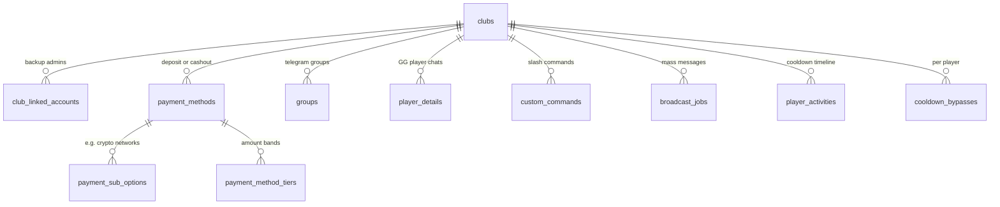
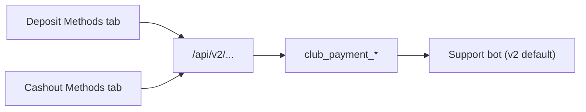

# Database schema and business logic

This document describes the relational model in [`db/models.py`](../db/models.py), how pieces relate, and how the **bot** and **dashboard API** use them. Tables are created automatically via SQLAlchemy `Base.metadata.create_all` when the API or bot starts (no separate migration runner in normal operation).

Typical deployment uses **PostgreSQL** (`DATABASE_URL`). Types below match the SQLAlchemy declarations; exact SQL types may vary slightly by dialect.

---

## High-level relationships



---

## Tables

### `clubs`

One row per **club** (poker/gaming room operator). The **primary** Telegram identity is `telegram_user_id` (must be globally unique). Settings drive welcome/list copy, optional **simple** deposit/cashout (skip interactive flow), **cashout cooldown** and **business hours**, and feature toggles.

| Column | Type | Business meaning |
|--------|------|------------------|
| `id` | integer PK | Internal id; referenced everywhere. |
| `name` | string(100) | Display name in dashboard. |
| `telegram_user_id` | bigint, unique | Primary owner’s Telegram user id; `/set` in DM applies to this club. |
| `welcome_*` | type, text, file_id, caption | Message when bot is added to a group (see **Groups**). |
| `list_*` | type, text, file_id, caption | Content for `/list` (group uses linked club; DM uses user’s own club if they are the owner). |
| `allow_multi_cashout` | bool | If true, `/cashout` lets players pick multiple methods then **Done**; if false, one method then submit. |
| `allow_admin_commands` | bool | If false, global `ADMIN_USER_IDS` from [`config.py`](../config.py) cannot use `/deposit` or `/cashout` in this club’s groups (silent ignore). |
| `deposit_simple_mode` + `deposit_simple_*` | bool + content | When on, `/deposit` sends one canned response (text/photo) with no amount/method UI. |
| `cashout_simple_mode` + `cashout_simple_*` | bool + content | Same for `/cashout`; no cooldown UI in-flow (eligibility still checked first). |
| `cashout_cooldown_enabled` | bool | Enforces wait between **cashouts** based on last activity (see **Player activity**). |
| `cashout_cooldown_hours` | int | Hours after last **deposit or cashout** before another cashout is allowed. |
| `cashout_hours_enabled` | bool | Restricts cashout to a daily window (interpreted in **America/New_York** in code). |
| `cashout_hours_start` / `cashout_hours_end` | string(5) | e.g. `08:00`–`23:00` local to that timezone. |
| `is_active` | bool | Inactive clubs are excluded from owner resolution in bot queries. |
| `created_at` | datetime | Server default `now()`. |

**Business logic:** Club staff = primary `telegram_user_id` **or** any row in `club_linked_accounts` for that `club_id`. They are exempt from cashout cooldown checks. Global admins are not “staff” unless linked; they follow the same rules as players unless `allow_admin_commands` allows them to use deposit/cashout in groups.

---

### `club_linked_accounts`

**Backup** Telegram accounts that share the same club configuration as the primary. Each `telegram_user_id` is **globally unique** (cannot be another club’s primary or another link).

| Column | Type | Business meaning |
|--------|------|------------------|
| `id` | integer PK | |
| `club_id` | FK → `clubs.id` CASCADE | |
| `telegram_user_id` | bigint, unique | Linked user; can add bot to groups, trigger staff-only custom commands, etc. |
| `created_at` | datetime | |

**Business logic:** Documented in [`LINKED_ACCOUNTS.md`](LINKED_ACCOUNTS.md). `/set`, `/mycmds`, `/delete` in private chat remain **primary-only**; linked users use the dashboard or the primary.

---

### `payment_methods`

Configurable **deposit** and **cashout** rails per club. `direction` is either `deposit` or `cashout`. The bot filters methods by **entered amount** against `min_amount` / `max_amount`, then shows inline keyboards; responses can be plain text or Telegram **photo** (`response_file_id`, `response_caption`).

| Column | Type | Business meaning |
|--------|------|------------------|
| `id` | integer PK | |
| `club_id` | FK → `clubs.id` CASCADE | |
| `direction` | string(10) | `deposit` or `cashout` (DB check constraint). |
| `name`, `slug` | string(50) | **Unique `(club_id, direction, slug)`**. `slug` is for internal reference; labels use `name`. |
| `min_amount`, `max_amount` | numeric(12,2), nullable | Optional band; method hidden if amount is out of range. |
| `has_sub_options` | bool | If true, bot may show `payment_sub_options` after method pick. |
| `response_type`, `response_text`, `response_file_id`, `response_caption` | | Default response when **no tier** matches and **no** sub-option path (or tier fallback). |
| `is_active` | bool | Inactive methods hidden from flows and simulate API. |
| `sort_order` | int | Ordering in UI and keyboards (reorder API). |
| `created_at` | datetime | |

**Business logic:**

- **Tiers** (`payment_method_tiers`): For a given amount, the bot selects the matching tier (if any) and uses that row’s response instead of the method default. Used for amount-dependent instructions.
- **Sub-options** (`payment_sub_options`): If `has_sub_options` and options exist, user picks a sub-option; response comes from that row. Typical for multiple networks under one “Crypto” method.

Deposit flow records **`player_activities`** with `activity_type = 'deposit'` after a successful completion. Cashout does the same with `'cashout'`.

---

### `payment_sub_options`

Sub-choices under one **payment method** (e.g. USDT vs BTC). Unique **`(method_id, slug)`**.

| Column | Type | Business meaning |
|--------|------|------------------|
| `id` | integer PK | |
| `method_id` | FK → `payment_methods.id` CASCADE | |
| `name`, `slug` | string(50) | |
| `response_*` | | Same pattern as method. |
| `is_active` | bool | |
| `sort_order` | int | |

---

### `payment_method_tiers`

Optional **amount bands** for a method. Each tier has `label`, optional min/max, and its own `response_*`. The bot picks the tier whose bounds contain the user’s amount (see `get_tier_for_amount` in [`bot/services/club.py`](../bot/services/club.py)).

| Column | Type | Business meaning |
|--------|------|------------------|
| `id` | integer PK | |
| `method_id` | FK → `payment_methods.id` CASCADE | |
| `label` | string(50) | Shown in internal logic / display name assembly. |
| `min_amount`, `max_amount` | numeric(12,2), nullable | |
| `response_*` | | |
| `sort_order` | int | |

---

### `groups`

Maps a **Telegram group/supergroup** (`chat_id` = Telegram chat id) to exactly one **club**. When the bot is added to a group, the linking user must be the club’s **primary** or a **linked** account; the row is created or updated.

| Column | Type | Business meaning |
|--------|------|------------------|
| `chat_id` | bigint PK | Telegram group id. |
| `club_id` | FK → `clubs.id` CASCADE | Which club’s config applies (`/deposit`, `/cashout`, `/list`, custom commands, etc.). |
| `name` | string(255), nullable | **Current Telegram group title** — updated on every `NEW_CHAT_TITLE` event, and refreshed on `/deposit` / `/cashout`. Intended lookup key `(club_id, name)` → `chat_id` for downstream integrations (`find_group_chat_id_by_name` in [`bot/services/club.py`](../bot/services/club.py)). |
| `first_deposit_claimed` | bool | Promo / first-deposit tracking. |
| `added_at` | datetime | |

**Indexes:** `ix_groups_club_id_name` on `(club_id, name)` for title lookup (see [`migrate_groups_name_index.py`](../migrate_groups_name_index.py)).

**Title sync:** [`update_group_name()`](../bot/services/club.py) keeps `groups.name` in sync and also updates `support_group_chats.telegram_chat_title` for any row with the same `telegram_chat_id`. Triggered from [`on_new_chat_title`](../bot/handlers/track.py) on every rename (even when player bind fails). Run [`backfill_group_names.py`](../backfill_group_names.py) once after deploy to fix historical stale titles.

**Business logic:** `/deposit` and `/cashout` only run in groups that have a row here. **Broadcast** sends to **all** `chat_id`s for the club’s `groups`. There is no per-group override table; everything is club-level.

---

### `player_details`

Maps an external **GG player id** to a **club** and a list of **Telegram group chat ids** (`chat_ids`). One row per **`(gg_player_id, club_id)`**; multiple groups are stored in the **`BIGINT[]`** column (not `INTEGER[]`, so typical Telegram supergroup ids fit).

| Column | Type | Business meaning |
|--------|------|------------------|
| `id` | integer PK | |
| `chat_ids` | `bigint[]` | Telegram group chat ids for this player–club link. |
| `gg_player_id` | string(255) | External GG player identifier. |
| `gg_nickname` | string(255) nullable | In-game nickname from gg-computer Mongo `player_details` (sync/backfill). |
| `club_id` | FK → `clubs.id` CASCADE | |

**Constraint:** `uq_player_details_gg_player_club` — unique `(gg_player_id, club_id)`.

**Indexes:** B-tree on `club_id` and `gg_player_id`; **GIN** on `chat_ids` for containment queries (e.g. `chat_ids @> ARRAY[id]::bigint[]`).

**No FK to `groups`:** PostgreSQL cannot attach a foreign key to individual elements of an array. Whether each id exists in `groups` must be enforced in **application code** (or custom triggers). Deleting a `groups` row does **not** remove that `chat_id` from arrays automatically.

**Migration:** [`migrate_player_details.py`](../migrate_player_details.py) (`DATABASE_URL=... python migrate_player_details.py`). Nickname column: [`migrate_player_details_gg_nickname.py`](../migrate_player_details_gg_nickname.py). New deploys also get the table from `Base.metadata.create_all` once the model exists.

**Nickname sync:** After gg-computer `POST /process-week/sync`, call [`POST /api/weekly-stats/sync-nicknames`](../docs/API.md) or run [`scripts/backfill_player_details_gg_nickname.py`](../scripts/backfill_player_details_gg_nickname.py). Bot bind (`/track`, title change) best-effort refreshes one row via `GET /player-details`.

**Bulk import (CSV):** [`scripts/import_player_details_csv.py`](../scripts/import_player_details_csv.py) reads `chat_id`, `gg_player_id`, `club_id` (supports `[n]` and `"[2, 3]"`). It aggregates rows, merges `chat_ids` on duplicate `(gg_player_id, club_id)`, and uses `ON CONFLICT` to merge with existing DB rows. **Strict validation:** `gg_player_id` must match `^[0-9]{1,48}-[0-9]{1,48}$`; `chat_id` must be negative (Telegram group chats) unless `--allow-nonnegative-chat-id`; `club_id` must be in `[1, 1000000]`; control characters and CSV formula prefixes (`=`, `+`, `@` on non-chat columns) are stripped. Run **dry run** first (default): `python scripts/import_player_details_csv.py --csv player_data_mapped.csv`. To write: `DATABASE_URL=... python scripts/import_player_details_csv.py --csv player_data_mapped.csv --apply`. Rows with unknown `club_id` in the DB or invalid fields are skipped (warnings printed).

**Auto-tracking via group title:** The bot can bind a group chat to `player_details` by parsing the group title and appending the chat id to `chat_ids` for the `(gg_player_id, club_id)` row.

- **One-group-per-(club,player)**: The bot enforces that a given `(club_id, gg_player_id)` pair cannot be tracked by multiple different Telegram group chats. If another group chat id is already present in `chat_ids` for that row, the bind is blocked and the bot returns a conflict message (title-change and “bot added” triggers still remain silent only for invalid format, not for conflicts).
- **Format**: `SHORTHAND / GGPLAYERID / anything` (example: `GTO / 8190-5287 / ThePirate343`). Round Table may use a combined prefix when a player deposits via both unions: `RT AT / GGPLAYERID / anything`.
- **Club resolution**: `SHORTHAND` is mapped to a canonical `clubs.name` via `CLUB_SHORTHAND_TO_NAME` in [`config.py`](../config.py), then resolved to `clubs.id` (case-insensitive exact match).
- **Triggers**:
  - Rename the group title (bot listens for NEW_CHAT_TITLE). If invalid format, bot is silent.
  - `/track` in the group to bind now (responds with invalid format if it can't parse/resolve).
  - `/info` shows what GG player id(s) are currently bound for this chat (or Not bound).

---

### `broadcast_jobs`

Tracks **dashboard-initiated broadcasts** to all linked groups. Status values include `running`, `done`, `cancelled`. Payload snapshot is stored (`response_type`, text, file id, caption) for audit; progress fields `sent`, `failed`, `errors_json` update during the async send. See [`api/routes/broadcast.py`](../api/routes/broadcast.py).

| Column | Type | Business meaning |
|--------|------|------------------|
| `id` | integer PK | |
| `club_id` | FK → `clubs.id` CASCADE | |
| `status` | string(20) | |
| `total_groups` | int | Target count at start. |
| `sent`, `failed` | int | Progress counters. |
| `errors_json` | text | JSON array of error strings (truncated in worker). |
| `response_*` | | Copy of message being broadcast. |
| `created_at`, `finished_at` | datetime | |

---

### `player_activities`

Append-only style log of **completed** deposit and cashout actions for **cooldown**. One row per completion (not per message). `cancelled` exists so a user can abort a cashout **after** a row was written in edge cases—`cancel_last_cashout_activity` marks the latest cashout row cancelled so cooldown looks back to the previous non-cancelled activity.

| Column | Type | Business meaning |
|--------|------|------------------|
| `id` | integer PK | |
| `club_id` | FK → `clubs.id` CASCADE | |
| `telegram_user_id` | bigint | Player (audit; eligibility is per group). |
| `chat_id` | bigint | Support group where it happened; **cooldown key**. |
| `activity_type` | string(10) | `deposit` or `cashout`. |
| `cancelled` | bool | |
| `created_at` | datetime | |

**Business logic:** `check_cashout_eligibility` uses the **latest non-cancelled** deposit or cashout timestamp for that **support group** (`club_id` + `chat_id`). If cooldown is enabled, the next `/cashout` in that group must wait `cashout_cooldown_hours` after that timestamp (subject to business hours and bypasses). Admin `/add` and `/cash` set the timer for the current group without replying to a message.

---

### `cooldown_bypasses`

Per **support group chat** exceptions for cooldown only (not for business hours alone—see code in `check_cashout_eligibility`).

| Column | Type | Business meaning |
|--------|------|------------------|
| `id` | integer PK | |
| `club_id` | FK → `clubs.id` CASCADE | |
| `chat_id` | bigint | Support group the bypass applies to. |
| `telegram_user_id` | bigint | Legacy; unused for eligibility. |
| `bypass_type` | string(20) | `one_time` (consumed on next successful check) or `permanent`. |
| `used` | bool | For one-time bypass after use. |
| `created_at` | datetime | |

**Business logic:** Granted via `/bypass` and `/bypasspermanent` in the support group (no reply required); see [`bot/handlers/bypass.py`](../bot/handlers/bypass.py). Run [`migrate_cooldown_bypass_chat_id.py`](../migrate_cooldown_bypass_chat_id.py) on existing DBs; re-grant bypasses per group after migration.

---

### `custom_commands`

Club-defined **slash commands** (without the leading slash in the column) with optional **customer visibility**.

| Column | Type | Business meaning |
|--------|------|------------------|
| `id` | integer PK | |
| `club_id` | FK → `clubs.id` CASCADE | |
| `command_name` | string(32) | **Unique per club** (`uq_club_command`); stored lowercased on create/update via API. |
| `response_*` | | Same text/photo pattern. |
| `customer_visible` | bool | If false, only club staff + global admins can trigger in groups; DM behavior follows router rules. |
| `is_active` | bool | |

**Business logic:** The bot resolves the group’s `club_id`, then looks up `command_name`. If `customer_visible` is false, the user must be staff or in `ADMIN_USER_IDS` (see [`bot/handlers/commands.py`](../bot/handlers/commands.py)). `/set` in DM syncs presets into this table for the owner’s club.

---

## Payment config (v2)

Dashboard **Deposit Methods** and **Cashout Methods** tabs edit `club_payment_*` via `/api/v2`. Legacy `/api/clubs/.../methods` CRUD routes are removed. The support bot reads v2 by default ([`bot/services/club_payment_v2.py`](../bot/services/club_payment_v2.py)); set `BOT_USE_PAYMENT_V2=0` to fall back to legacy `payment_*` tables.

### Principles

- **No legacy columns** — v2 tables have no `legacy_*` fields and no FKs to old payment tables.
- **Greenfield data** — config is authored in the dashboard payment tabs, via `/api/v2`, or seed scripts; no auto-copy from legacy.
- **UI-aligned model** — method = envelope; tier = amount band + default message + Stripe; variant = rotation inside a tier; sub-option = crypto branches.



### Tables

#### `club_payment_methods`

Method **envelope** only — no `response_*` or Stripe fields on the method row.

| Column | Business meaning |
|--------|------------------|
| `club_id`, `direction`, `name`, `slug` | Identity; **unique `(club_id, direction, slug)`** |
| `min_amount`, `max_amount` | Absolute amount envelope for the method |
| `has_sub_options`, `is_active`, `sort_order` | Listing and crypto branching |
| `deposit_limit`, `accumulated_amount` | Deposit cap tracking (deposit direction only) |
| `created_at`, `updated_at` | Audit |

#### `club_payment_tiers`

Amount band + tier-level Stripe checkout defaults. **Player copy lives on variants**, not tiers (except legacy rows pending migration).

| Column | Business meaning |
|--------|------------------|
| `method_id` | FK → `club_payment_methods` CASCADE |
| `label`, `min_amount`, `max_amount`, `sort_order` | Band; **unique `(method_id, label)`** |
| `response_*` | Deprecated for new config — leave empty; use variants |
| `use_group_checkout_link`, `group_checkout_provider`, `hyperlink_text` | Per-group Stripe checkout defaults (variants inherit when override is null) |
| `checkout_min_amount`, `checkout_max_amount` | Optional Stripe session bounds |

Creating a method via API seeds a **Default** tier (band only) plus one empty **Default** variant when `has_sub_options=false`.

Tier create/update validates that each band fits the method absolute min/max and does not overlap sibling tiers (API + dashboard).

#### `club_payment_tier_variants`

Weighted rotation **inside a tier** (`tier_id` NOT NULL). **Required:** every tier on non-sub-option methods must have ≥ 1 variant.

| Column | Business meaning |
|--------|------------------|
| `method_id`, `tier_id` | FKs; variant is always tier-scoped |
| `label`, `weight`, `sort_order` | Rotation; **unique `(tier_id, label)`**, `weight >= 1` |
| `response_*` | Player message shown to users |
| `use_group_checkout_link` | `NULL` = inherit tier; `true`/`false` = override |
| `group_checkout_provider`, `hyperlink_text` | Stripe when override is enabled |
| `checkout_min_amount`, `checkout_max_amount` | Optional checkout bounds |

#### `club_payment_sub_options`

Same pattern as legacy sub-options; FK to v2 method only. **Unique `(method_id, slug)`**.

### V2 API (`/api/v2`)

All payment-config routes require dashboard JWT. The flow simulator (`GET /api/clubs/{club_id}/simulate/{direction}`) also reads v2 tables.

| Method | Path | Purpose |
|--------|------|---------|
| GET | `/api/v2/clubs/{club_id}/methods?direction=deposit` | List methods with nested `tiers[].variants[]` |
| POST | `/api/v2/clubs/{club_id}/methods` | Create method (+ Default tier) |
| GET/PUT/DELETE | `/api/v2/methods/{id}` | Read / update / delete method |
| POST | `/api/v2/methods/{id}/reset-accumulated` | Reset deposit cap counter |
| PUT | `/api/v2/clubs/{club_id}/methods/reorder` | Body: `{ "order": [method_ids…] }` |
| GET/POST | `/api/v2/methods/{method_id}/tiers` | List / create tiers |
| PUT/DELETE | `/api/v2/tiers/{id}` | Update / delete tier (cannot delete last tier) |
| GET/POST | `/api/v2/tiers/{tier_id}/variants` | List / create tier variants |
| PUT/DELETE | `/api/v2/variants/{id}` | Update / delete variant |
| GET/POST | `/api/v2/methods/{method_id}/sub-options` | List / create sub-options |
| PUT/DELETE | `/api/v2/sub-options/{id}` | Update / delete sub-option |

Pydantic schemas: [`api/schemas_v2.py`](../api/schemas_v2.py). Router: [`api/routes/v2_payment.py`](../api/routes/v2_payment.py).

### Data-entry workflow

1. Draft per-club config (methods, tiers, variants, copy, Stripe) — e.g. from ChatGPT prompts using CSV exports in `backups/` as human reference only.
2. Enter data in dashboard **Deposit Methods** / **Cashout Methods**, call `/api/v2` directly, or run a one-shot seed script (e.g. `python scripts/seed_v2_round_table_crypto.py --apply` for Round Table deposit Crypto, `python scripts/seed_v2_creator_club_crypto.py --apply` for Creator Club deposit Crypto (11 sub-options),
`python scripts/seed_v2_clubgto_crypto.py --apply` for ClubGTO deposit Crypto (12 sub-options — includes BEP20/BNB; no SOL-token variants), `python scripts/seed_v2_clubgto_zelle.py --apply` for ClubGTO deposit Zelle — 2 tiers (Under 399 / Over $400), 1 Default variant each (weight 100), `python scripts/seed_v2_clubgto_applepay.py --apply` for ClubGTO deposit Apple Pay — 1 Default tier with Stripe, 1 Default variant (weight 100), `python scripts/seed_v2_clubgto_debitcard.py --apply` for ClubGTO deposit Debit Card — same Stripe pattern, `python scripts/seed_v2_clubgto_cashapp.py --apply` for ClubGTO deposit Cashapp — 2 tiers and 3 variants (180/25 on Over), `python scripts/seed_v2_clubgto_venmo.py --apply` for ClubGTO deposit Venmo — 2 tiers and 5 photo variants (35/35/15/15 on Over), `python scripts/seed_v2_creator_club_zelle.py --apply` for Creator Club Zelle, `python scripts/seed_v2_creator_club_applepay.py --apply` for Creator Club Apple Pay, `python scripts/seed_v2_creator_club_debitcard.py --apply` for Creator Club Debit Card, `python scripts/seed_v2_creator_club_cashapp.py --apply` for Creator Club Cashapp — 2 tiers and 3 variants (80/20 on Over), `python scripts/seed_v2_creator_club_venmo.py --apply` for Creator Club Venmo — 1 Default tier and 4 weighted variants, `python scripts/seed_v2_round_table_zelle.py --apply` for Round Table Zelle, `python scripts/seed_v2_round_table_applepay.py --apply` for Round Table Apple Pay, `python scripts/seed_v2_round_table_debitcard.py --apply` for Round Table Debit Card, `python scripts/seed_v2_round_table_cashapp.py --apply` for Round Table Cashapp — 2 tiers and 3 variants, `python scripts/seed_v2_round_table_venmo.py --apply` for Round Table Venmo — 1 Default tier and 4 weighted variants, or `python scripts/seed_v2_round_table_cashout.py --apply` for Round Table cashout — Crypto (11 sub-options) + Cashapp/Zelle/Venmo (1 Default tier + variant each), `python scripts/seed_v2_creator_club_cashout.py --apply` for Creator Club cashout — same 4-method pattern, `python scripts/seed_v2_clubgto_cashout.py --apply` for ClubGTO cashout — Crypto (12 sub-options incl. BEP20) + Cashapp (min $13) / Zelle / Venmo (min $50)). Crypto methods store player copy on **sub-options**; non-sub-option methods store copy on **tier variants** (≥ 1 per tier), not on tier `response_*`.
3. If upgrading existing v2 rows that still have tier-level copy, run `python scripts/migrate_v2_tier_response_to_variants.py --apply` once to move messages into Default variants.
4. Save and reload to validate structure (Details + Amount tiers tabs).
5. Bot worker uses v2 by default; set `BOT_USE_PAYMENT_V2=0` only if rolling back to legacy tables.

### Migration script

For existing PostgreSQL databases, run once:

```bash
DATABASE_URL=... python migrate_club_payment_v2.py
```

New deploys also get tables from `Base.metadata.create_all` once the models exist in [`db/models.py`](../db/models.py).

---

## Constraints summary

| Constraint | Table |
|------------|--------|
| `uq_club_direction_slug` | `payment_methods` — unique `(club_id, direction, slug)` |
| `ck_direction` | `payment_methods` — `direction IN ('deposit', 'cashout')` |
| `uq_method_slug` | `payment_sub_options` — unique `(method_id, slug)` |
| `uq_club_command` | `custom_commands` — unique `(club_id, command_name)` |
| `uq_player_details_gg_player_club` | `player_details` — unique `(gg_player_id, club_id)` |
| Unique | `clubs.telegram_user_id`, `club_linked_accounts.telegram_user_id` |

Foreign keys generally use **ON DELETE CASCADE** from `clubs` so child rows disappear if a club is deleted.

---

## Operational notes

- **Schema changes:** New columns may be added with manual SQL or small scripts (e.g. [`migrate_cooldown.py`](../migrate_cooldown.py), [`migrate_player_details.py`](../migrate_player_details.py)) if `create_all` already ran without them.
- **Legacy:** Root [`main.py`](../main.py) uses older tables (`user_commands`, `group_club`); migration from that layout is described in [`db/migrate.py`](../db/migrate.py). The running bot uses [`bot/`](../bot/) and the models above.

---

## See also

- [API.md](API.md) — REST surface that edits most of these tables
- [LINKED_ACCOUNTS.md](LINKED_ACCOUNTS.md) — Linked accounts behavior in detail
